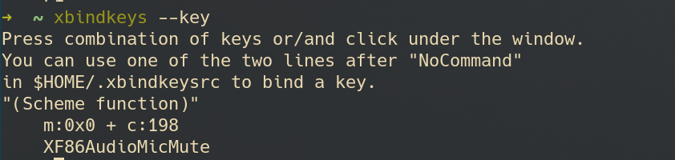

# Xbindkeys

## 软件介绍

可以通过该软件将某些功能 `映射` 到某几个键位上\
使用主要配合 `dwm` 或者 `i3wm` 这种平铺式的，无快捷绑定键位设定的窗口管理器

## 配置

### 下载软件

```shell
pacman -S xbindkeys
```

下载之后执行 `xbindkeys -v` 查看是否输出

### 生成配置文件

```shell
xbindkeys -d > .xbindkeysrc
```

执行完毕之后会在 `~/` 生成 `.xbindkeysrc` 文件

### 键位查询

电脑的键位绑定可以通过 `xbindkeys --key` 来确定，例如音量控制键:



### 功能绑定

```xbindkeysrc
"Functions"
	Key
```

编辑之后重新运行 `xbindkeys`

```shell
# 关闭 xbindkeys
killall xbindkeys
# 重新运行 xbindkeys
xbindkeys
```
